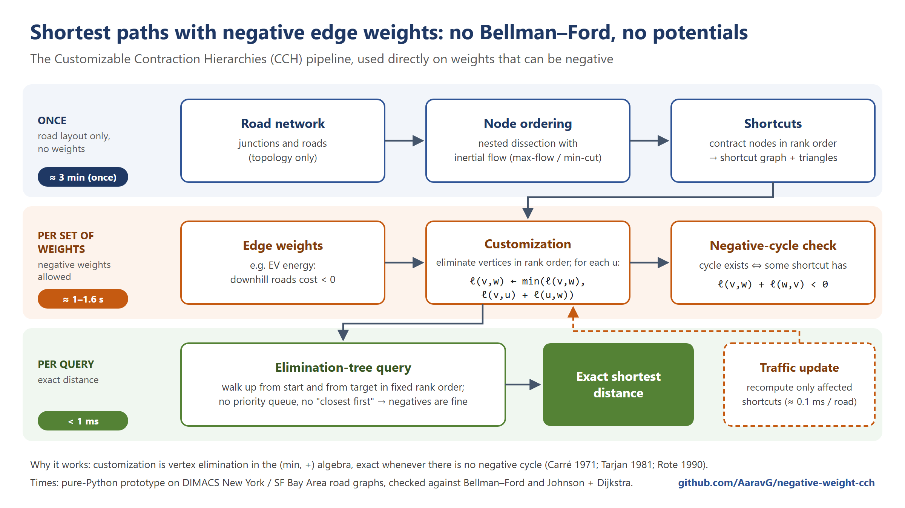

# Potential-free CCH for negative edge weights

Shortest paths on road networks with **negative edge weights**, motivated by energy-optimal routing for electric vehicles, where regenerative braking makes downhill segments cost negative energy.

The core question: can **Customizable Contraction Hierarchies (CCH)** handle negative weights *without* first computing a potential (Johnson / Bellman–Ford reweighting, or a height-induced one)?

The answer is yes, and it follows from **classical theory**: eliminating vertices while adding short-cut arcs, in any order including nested-dissection orders, is exact for shortest paths with negative arc weights as long as there is no negative cycle. See [Rote, *Path Problems in Graphs*, 1990](https://page.mi.fu-berlin.de/rote/Papers/pdf/Path+problems+in+graphs.pdf), §2.1 and §4.2–4.5; Carré 1971; Lipton, Rose & Tarjan 1979; Tarjan 1981.

This repository does **not** claim a new algorithm. It contributes:

- the explicit connection: modern CCH, whose literature assumes non-negative weights, inherits this property;
- the practical consequences: queries, updates, negative-cycle detection, a battery-constrained variant, and which CCH acceleration techniques still apply;
- implementations in Python, Numba and C++, with tests and experiments up to the full USA road network.

Shared as an **open technical log for review**. If this application to CCH is already documented, please open an issue and point me to it.



## Key observation

- **Customization.** CCH eliminates the vertices in rank order (a nested-dissection order). When vertex `u` is eliminated, every triangle in which `u` is the lowest vertex updates the shortcut between the other two:

      ℓ⁺(v,w) ← min(ℓ⁺(v,w), ℓ⁺(v,u) + ℓ⁺(u,w))

  This is vertex elimination in the (min, +) semiring: a shortcut ends up holding the best path through lower-ranked vertices (Rote §4.3), which is exact whenever there are no negative cycles (Rote §4, Theorems 1–4).
- **Query.** The elimination-tree ("sweep") query relaxes a small ancestor DAG in rank order. It needs no priority queue and no Dijkstra stopping rule — exactly the parts that fail with negative weights.
- **Negative cycles.** A negative cycle exists **iff** some shortcut has `ℓ⁺(v,w) + ℓ⁺(w,v) < 0`, a CCH form of the classical pivot sign test (Rote §4.4). It can be checked after customization, during it, or, after an update, on the changed shortcuts only.
- **Updates.** Partial re-customization recomputes the affected shortcuts, lowest first.
- **Potentials change nothing.** Reweighting with any potential shifts every customized value by a constant, so computing one first is never necessary (proof in the technical note).

Proofs, complexity and limitations: [`docs/technical_note.md`](docs/technical_note.md). Every algorithm used here is explained in plain language in [`docs/algorithms.md`](docs/algorithms.md).

## Layout

| Directory | Contents |
|---|---|
| [`python/`](python) | reference implementation (standard library), Numba versions for large graphs, baselines, experiments, tests — see [`python/README.md`](python/README.md) |
| [`cpp/`](cpp) | single-file C++20 implementation and the classical baselines — see [`cpp/README.md`](cpp/README.md) |
| [`docs/`](docs) | technical note, algorithm glossary, full statistics (PDF), figures |
| [`results/`](results) | every result table produced by the experiments |
| [`scripts/`](scripts) | road-data download |

## Results

All answers are verified against independent references: Bellman–Ford on the small graphs, and Johnson + Dijkstra (itself validated against Bellman–Ford) on the large ones.

**C++, real elevation** ([`results/results_cpp.md`](results/results_cpp.md))

| Graph | Customization (no potential) | Our query | Classical CCH query (Dijkstra + stalling) | Johnson + Dijkstra |
|---|---:|---:|---:|---:|
| New York (264k nodes) | 0.04 s | **0.013 ms** | 0.076 ms | 16 ms |
| SF Bay Area (321k) | 0.03 s | **0.007 ms** | 0.049 ms | 13 ms |
| **Full USA (23.9M nodes, 58.3M arcs)** | **5.8 s** | **0.62 ms** | 2.69 ms | 1,577 ms |

The classical variants also need a potential first: Johnson's costs 1.3–2.6 s on the USA; a height-induced one is free but only exists for simple cost models. The query gain itself comes from the sweep query rather than from dropping the potential — what the potential-free variant removes is the potential computation. One-time, weight-independent ordering: 2.8 s (NY), 20 min (USA).

**Three implementations of the same algorithms** (New York)

| | Ordering | Customization | Query |
|---|---:|---:|---:|
| Pure Python ([`python/cch.py`](python/cch.py)) | 202 s | 1.6 s | 0.77 ms |
| Numba ([`python/cch_nb.py`](python/cch_nb.py)) | 12 s | 0.1 s | 0.04 ms |
| **C++ ([`cpp/cch.cpp`](cpp/cch.cpp))** | **2.8 s** | **0.04 s** | **0.012 ms** |

**Scaling** (pure Python, regions cut from the USA graph)

| Map | Nodes | CCH query | Johnson + Dijkstra | Customization | Correct |
|---|---:|---:|---:|---:|---:|
| New York | 264k | 0.8 ms | 117–128 ms | 1.6 s | 200/200 |
| Florida | 1.1M | 1.15 ms | 931–994 ms | 5.2 s | 200/200 |
| California + W. Nevada | 1.9M | 3.0–3.2 ms | 1.3–1.4 s | 11 s | 200/200 |

On the full USA in Numba: customization 7.2 s over 3.15 billion triangles (none stored), negative-cycle scan 0.03 s, query 1.0 ms, 100/100 correct, peak memory 6.7 GB ([`results/results_nb_USA.md`](results/results_nb_USA.md)).

**Updates and negative cycles.** One changed road: 0.0–0.6 ms; 1,000 changed roads: 0.25–0.65 s; every partial update matched a full recomputation exactly. An injected negative cycle is found in 0.03–0.22 s, and after an update only the changed shortcuts need checking.

**Textbook A\*** with a straight-line heuristic returns **wrong answers on about half of all queries** once edges can be negative — one reason this problem needs care.

Full tables are in [`results/`](results); every table from every run is collected in [`docs/test_statistics.pdf`](docs/test_statistics.pdf). Python timings are Python timings; the ratios between methods are the meaningful part.

## Real elevation

[`python/elevation.py`](python/elevation.py) fetches the public [AWS Terrain Tiles](https://registry.opendata.aws/terrain-tiles/) (SRTM/USGS) and decodes the PNGs with the standard library only; `dimacs.py` then offers the `ev_real` metric. Climbing one metre is charged as 50 metres of driving, so descents steeper than about 3% come out negative. Real terrain gives 10.0% negative edges on New York and 10.3% on the Bay Area, with essentially unchanged timings. The older synthetic weighting (`ev`) is still available for comparison.

## Which CCH acceleration techniques survive?

Details and reproduction: [`results/results_pruning.md`](results/results_pruning.md) (`python/test_techniques.py`).

- **Exact:** basic customization and the elimination-tree query, stall-on-demand, perfect customization, witness pruning (without zero-length cycles, as for non-negative weights), path unpacking, partial updates, level-parallel customization.
- **Fail (3-vertex counterexamples):** Dijkstra-based queries, the distance pruning of the elimination-tree query, and early termination.
- **New:** a feasible potential can be read off the customized CCH in two linear sweeps (0.33-0.36 s on the USA vs 1.3-2.6 s Bellman-Ford).

## Battery constraints

With capacity M, each road maps the state of charge at its start to the charge at its end:

    f(b) = min(out, b − cost)   if b ≥ in,        f(b) = −∞   otherwise (infeasible)

`in` is the charge needed to start without running empty, `out` the highest possible charge at the end (the battery cannot overfill), `cost` the net energy. These are the cost functions of Eisner, Funke & Storandt (2011) written in terms of remaining charge; `−∞` below `in` keeps them monotone. They are closed under composition and, with pointwise maximum, form an ordered semiring, so the same elimination theory applies — no loop can gain charge. See [`python/cch_battery.py`](python/cch_battery.py).

| | Small graphs | NY / BAY | Full USA |
|---|---|---|---|
| Correct | 15,540 checks | 120/120 | 40/40 at M = 0.25 D and M = D |
| Customization | — | 34–99 s | 8–15 min, 10 GB |
| Query | — | 1–6 ms | 2–44 ms |
| Shortcut directions with a single piece | — | 94–97% | 96–98% |
| Largest profile | ≤ 5 | 222–299 | 180 |

Profiles therefore do **not** blow up at continental scale: only 12 of 193M shortcut directions hold more than 100 pieces. The large ones are genuine trade-offs (pieces differ by 0.1–10%, far above rounding error), they concentrate at a few vertices, and they are identical across battery capacities ([`results/results_battery_profiles.md`](results/results_battery_profiles.md)). At M = 4 D the reference search needs hours per query, so that size reports performance only.

## Reproducing

```bash
python scripts/download_dimacs.py NY BAY
```

```bash
cd python && python test_cch.py && python test_cch_battery.py && python test_cch_extras.py
```

```bash
cd python && python cch_benchmark.py NY BAY
```

```bash
cd cpp && build.bat && python ../python/export_graph.py NY && cch.exe data/NY --queries 1000 --check 20 --shifted-cch
```

Road data: [9th DIMACS Implementation Challenge](http://www.diag.uniroma1.it/challenge9/) (not redistributed here). Python 3.10+; the Numba parts additionally need `numpy` and `numba`; the C++ part needs a C++20 compiler.

## Limitations

- The node ordering is a simple inertial-flow implementation; FlowCutter/KaHIP-style orders would give a shallower elimination tree (ours is 3,762 deep on the USA) and faster queries.
- Turn costs, one-to-many queries and hub labelling are not covered.
- The battery variant has no charging stops, and its M = 4 D results on the USA are unverified.
- Untested with negative weights: SIMD multi-metric customization (watch the "infinity plus a negative number" pitfall described in the technical note) and hub labelling.

## Status and feedback

Research in progress. If you know of prior work, spot an error in the proofs, or work on CH/CCH or EV routing, please open an issue.

The code was developed with the help of an AI coding assistant. Every result is checked against independent reference implementations included in this repository.

## Citing this work

GitHub's **"Cite this repository"** button uses [`CITATION.cff`](CITATION.cff):

```bibtex
@software{gupta2026negativecch,
  author = {Gupta, Aarav},
  title  = {Potential-free Customizable Contraction Hierarchies for Negative Edge Weights},
  year   = {2026},
  url    = {https://github.com/AaravG/negative-weight-cch}
}
```

## Acknowledgements

Günter Rote and Sabine Storandt kindly answered questions about the classical elimination theory and about CCH respectively; their comments shaped several parts of this work.

## License

**All rights reserved.** Published for reading, review and discussion; copying, modifying or reusing requires written permission — please [open an issue](https://github.com/AaravG/negative-weight-cch/issues). See [LICENSE](LICENSE).
