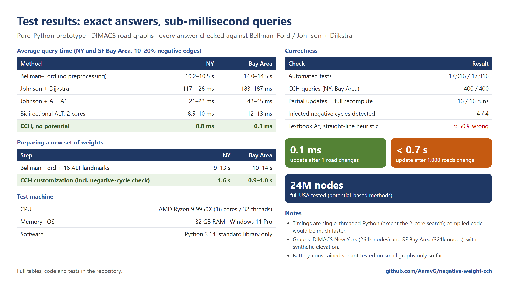

# Potential-free CCH for negative edge weights

Shortest paths on road networks with **negative edge weights**, motivated by energy-optimal routing for electric vehicles, where regenerative braking makes downhill segments cost negative energy.

The core question: can **Customizable Contraction Hierarchies (CCH)** handle negative weights *without* first computing a potential (Johnson / Bellman–Ford reweighting)?

The answer is yes, and it follows from **classical theory**. Algebraic path-problem theory shows that eliminating vertices while adding short-cut arcs, in any order including nested-dissection orders, is exact for shortest paths with negative arc weights as long as there is no negative cycle. See [Rote, *Path Problems in Graphs*, 1990](https://page.mi.fu-berlin.de/rote/Papers/pdf/Path+problems+in+graphs.pdf), §2.1, §4.2–4.5; and Carré 1971; Lipton, Rose & Tarjan 1979; Tarjan 1981.

This repository does **not** claim a new algorithm. It contributes:

- the explicit connection: modern CCH, whose literature assumes non-negative weights, inherits this property;
- the practical consequences (queries, updates, cycle checks);
- an implementation with tests and experiments on road networks.

It is shared as an **open technical log for review**. If this application to CCH is already documented or considered folklore, please open an issue and point me to it.


## Key observation

- **Customization.** CCH eliminates the vertices in rank order (a nested-dissection order). When vertex `u` is eliminated, every triangle in which `u` is the lowest vertex updates the shortcut between the other two:

      ℓ⁺(v,w) ← min(ℓ⁺(v,w), ℓ⁺(v,u) + ℓ⁺(u,w))

  This is vertex elimination in the (min, +) semiring. After the lower vertices are eliminated, a shortcut stores the best path through lower-ranked vertices (Rote §4.3), which is exact whenever there are no negative cycles (Rote §4, Theorems 1–4).
- **Query.** The elimination-tree query relaxes a small ancestor DAG in rank order. It needs no priority queue and no Dijkstra stopping rule, which are exactly the parts that fail with negative weights.
- **Negative cycles.** A negative cycle exists **iff** some shortcut has `ℓ⁺(v,w) + ℓ⁺(w,v) < 0`. This is a CCH form of the classical pivot sign test (Rote §4.4). After an update, only the changed shortcuts need checking.
- **Updates.** Partial re-customization recomputes affected shortcuts from their lower triangles, in rank order.

Proofs, complexity and limitations are in [`docs/technical_note.md`](docs/technical_note.md). Every algorithm used here is explained in [`docs/algorithms.md`](docs/algorithms.md).

## Results (pure Python, single-threaded)



All statistics (every table from every run) are in [`docs/test_statistics.pdf`](docs/test_statistics.pdf).

All answers are checked against Johnson + Dijkstra, which is itself validated against Bellman–Ford.

**Queries, DIMACS road graphs with 10–20% negative edges**

| Graph | Johnson + Dijkstra | Johnson + ALT A* | **CCH, no potential** |
|---|---:|---:|---:|
| New York (264k nodes) | 117–128 ms | 21–23 ms | **0.77 ms** |
| SF Bay Area (321k nodes) | 183–187 ms | 43–45 ms | **0.30 ms** |

**Preparing a new metric**

| Graph | Johnson's step + 16 ALT landmarks | **CCH customization** |
|---|---:|---:|
| New York | 9.1–12.5 s | **1.6 s** |
| SF Bay Area | 10.5–14.2 s | **0.9–1.0 s** |

The CCH time includes the negative-cycle check.

**Full USA road graph (23.9M nodes, 58.3M arcs), compiled with Numba** ([`results/results_nb_USA.md`](results/results_nb_USA.md), `cch_nb.py`, `run_nb.py`)

| | EV terrain | Random shift |
|---|---:|---:|
| Customization (3.15 billion triangles, not stored) | 7.2 s | 7.3 s |
| Negative-cycle scan | 0.03 s | 0.03 s |
| **CCH query, no potential** (median) | **1.0 ms** | **1.0 ms** |
| Johnson + Dijkstra query (compiled, reference) | 1,522 ms | 1,467 ms |
| Correct | 100/100 | 100/100 |

One-time ordering: 24 min (inertial flow, compiled). 96.7M shortcut arcs, elimination-tree depth 3,771. Peak memory 6.7 GB. Professional orderings (FlowCutter, KaHIP) would give a shallower tree and faster queries.

**Full USA, C++** ([`results/results_cpp.md`](results/results_cpp.md)): customization **5.8 s**, query **0.62 ms**, 20/20 correct; the classical Dijkstra-based CCH query on the same hierarchy needs 2.6–2.7 ms and a potential (Johnson: 1.3–2.6 s). One-time ordering 20 min.

**Scaling (pure Python, same code, regions cut from the USA graph)**

| Map | Nodes | CCH query | Johnson + Dijkstra | CCH customization | Correct |
|---|---:|---:|---:|---:|---:|
| New York | 264k | 0.8 ms | 117–128 ms | 1.6 s | 200/200 |
| Florida | 1.1M | 1.15 ms | 931–994 ms | 5.2 s | 200/200 |
| California + W. Nevada | 1.9M | 3.0–3.2 ms | 1.3–1.4 s | 11 s | 200/200 |

**Other results**

- **Updates:** a single changed road takes 0.0–0.6 ms; 1,000 changed roads take 0.25–0.65 s. The result matched full re-customization exactly in every test.
- **Full USA graph** (24M nodes, potential-based methods only): Johnson + Dijkstra 9–12 s per query, bidirectional ALT on 2 cores 0.8–1.2 s. Bellman–Ford took more than 35 minutes per query.
- **Textbook A\*** with a straight-line heuristic returns **wrong answers** on about 50% of queries when edges can be negative.

Full tables are in [`results/`](results/). Absolute times are Python times; compiled implementations would be much faster, and the ratios between methods are only indicative.

## Battery constraints (early work)

With a battery of capacity M, each road (or path) maps the state of charge `b` at its start to the charge at its end:

    f(b) = min(out, b − cost)   if b ≥ in,        f(b) = −∞   otherwise (infeasible)

- **in** is the minimum charge needed to start without the battery running empty along the way.
- **out** is the highest charge possible at the end, since the battery cannot exceed its capacity.
- **cost** is the net energy used (negative when energy is recovered).

Setting `f(b) = −∞` below `in` keeps every function monotone over the whole range. The charge functions are those of Eisner, Funke & Storandt (2011). They are closed under composition, and together with pointwise max they form an ordered semiring. The general elimination theory (Rote §3–4) therefore applies, since no loop can gain charge. See `cch_battery.py`.

Validated on small graphs (15,540 checks against step-by-step simulation and a label-correcting reference search) and on NY/BAY (below).

The main open question is **size**: each shortcut stores the upper envelope of several such functions (a "profile"), and it is not known whether profiles stay small on large road networks. On the small graphs they had at most 5 pieces. On the NY and Bay Area road graphs (three battery sizes each, 120/120 queries correct), profiles had **about 1.1 pieces on average, but a few reached 222–299 pieces**: no blow-up on average, but a heavy tail. Customization took 34–99 s and queries 1–6 ms. See [`results/results_battery.md`](results/results_battery.md).

**Full USA (23.9M nodes), compiled** ([`results/results_nb_battery_USA.md`](results/results_nb_battery_USA.md), `cch_nb_battery.py`): battery customization takes 8–15 min and 10 GB, queries 2–44 ms, and **40/40 answers are correct** at M = 0.25 D and M = D (at M = 4 D the reference search needs hours per query, so that size reports performance only). **96–98% of the 193M shortcut directions hold a single piece, only 12 exceed 100 pieces, and the largest is 180** — smaller than on New York, so there is no blow-up at continental scale.

A closer look ([`results/results_battery_profiles.md`](results/results_battery_profiles.md), `battery_profiles.py`): 94–97% of shortcut directions have exactly one piece and only 0.11–0.17% have more than 10. The large profiles are genuine trade-offs (their pieces differ by roughly 0.1–10%, far above rounding error), they concentrate at a few vertices of the hierarchy, and they are identical across battery capacities.

## Three implementations

| | Ordering (NY) | Customization (NY) | Query (NY) |
|---|---:|---:|---:|
| Pure Python (`cch.py`) | 202 s | 1.6 s | 0.77 ms |
| Numba (`cch_nb.py`) | 12 s | 0.1 s | 0.04 ms |
| **C++ (`cpp/cch.cpp`)** | **2.8 s** | **0.04 s** | **0.012 ms** |

All three agree with the reference answers. Build the C++ version with `cpp/build.bat` (MSVC) after exporting a graph with `export_graph.py`.

## Comparison with the classical (potential-based) pipeline

Measured on the same hierarchy in C++ ([`results/results_cpp.md`](results/results_cpp.md)):

| Approach | Potential needed | Query, NY (real elevation) | BAY |
|---|---|---:|---:|
| **Ours: no potential, sweep query** | **none** | **0.013 ms** | **0.007 ms** |
| Shifted metric + sweep query | Johnson or height | 0.021 ms | 0.010 ms |
| Height-potential CCH + Dijkstra query + stalling (Eisner/Baum style) | height (free) | 0.076 ms | 0.049 ms |
| Johnson-shifted CCH + Dijkstra query | Johnson | 0.071 ms | 0.046 ms |
| Johnson + plain Dijkstra | Johnson | 16 ms | 13 ms |

The query gain comes from the sweep query, not from dropping the potential. What the potential-free variant removes is the potential computation, which matters when the cost model admits no height-induced potential.

## Which CCH acceleration techniques survive?

[`results/results_pruning.md`](results/results_pruning.md): **perfect customization**, **witness pruning** (restricted to upper/intermediate triangles; ~60% of arc directions still removable), **path unpacking** (140/140 paths exact), **parallel customization** (bit-identical to serial, though not faster in our push-based variant) and **tie-based partial updates** (once they also propagate improvements) all stay exact. **Stall-on-demand is unsafe.**

## Real elevation

`elevation.py` fetches the public AWS Terrain Tiles (SRTM/USGS) and decodes the PNGs with the standard library only; `dimacs.py` then offers the `ev_real` metric (climbing 1 m costs 50 m of driving, sea floor clamped to 0). Real terrain gives 10.0% negative edges on New York and 10.3% on the Bay Area, with essentially unchanged timings.

## Repository layout

| Files | What |
|---|---|
| `cch.py`, `inertial_flow.py` | CCH with negative weights: ordering (inertial flow + Dinic max-flow), contraction, customization, partial updates, negative-cycle test, elimination-tree query |
| `cch_battery.py` | Battery-constrained customization (profiles of charge functions) and scalar queries |
| `graphs.py`, `dimacs.py` | Synthetic graphs with negative edges; DIMACS loader with EV-terrain and random-shift weightings |
| `preprocess.py`, `heuristics.py`, `search.py`, `parallel.py` | Baselines: Bellman–Ford/SPFA, Johnson, ALT, domain bound, A*, bidirectional A*, 2-process bidirectional A* |
| `bigcsr.py`, `bigsearch.py`, `usa_benchmark.py`, `usa_retime.py` | Memory-mapped pipeline for the full USA graph |
| `test_*.py` | Correctness tests |
| `*benchmark*.py`, `cch_memory.py` | Experiments |
| `docs/`, `results/` | Technical note, algorithm glossary, result tables |

## Running

Requires Python 3.10+. The pure-Python code uses the standard library only; the compiled full-USA pipeline (`cch_nb.py`, `run_nb.py`) additionally needs `numpy` and `numba`.

```bash
python test_correctness.py        # A*/ALT/bidirectional vs Bellman–Ford
python test_cch.py                # CCH: queries, bounds, updates, negative cycles
python test_cch_battery.py        # battery-constrained CCH
python benchmark.py --quick       # small synthetic benchmark (seconds)

python scripts/download_dimacs.py NY BAY    # ~14 MB into data/
python cch_benchmark.py NY BAY              # CCH vs Johnson/ALT (~20 min)
python battery_benchmark.py NY BAY          # battery-constrained CCH
```

Road data is from the [9th DIMACS Implementation Challenge](http://www.diag.uniroma1.it/challenge9/). It is not redistributed here; the download script fetches it. The elevation used for the EV weighting is **synthetic**. Real elevation data is future work.

## Limitations

- The inertial-flow ordering is simpler than FlowCutter/KaHIP.
- Synthetic elevation.
- Full-USA experiments use a Numba-compiled version; no C++ implementation yet.
- The battery model has no charging stops.

## Status and feedback

This is research in progress. If you know of prior work, spot an error in the proofs, or work on CH/CCH or EV routing, please open an issue.

The code was developed with the help of an AI coding assistant. All results are checked against independent reference implementations included in this repository.

## Citing this work

If you refer to or build on this work, please cite it. GitHub's **"Cite this repository"** button (from [`CITATION.cff`](CITATION.cff)) gives BibTeX and APA:

```bibtex
@software{gupta2026negativecch,
  author = {Gupta, Aarav},
  title  = {Potential-free Customizable Contraction Hierarchies for Negative Edge Weights},
  year   = {2026},
  url    = {https://github.com/AaravG/negative-weight-cch}
}
```

## License

**All rights reserved.** The code and documents are published for reading, review and discussion. Copying, modifying, redistributing or using them requires written permission. To ask for permission (research, teaching or commercial), please [open an issue](https://github.com/AaravG/negative-weight-cch/issues). See [LICENSE](LICENSE).
